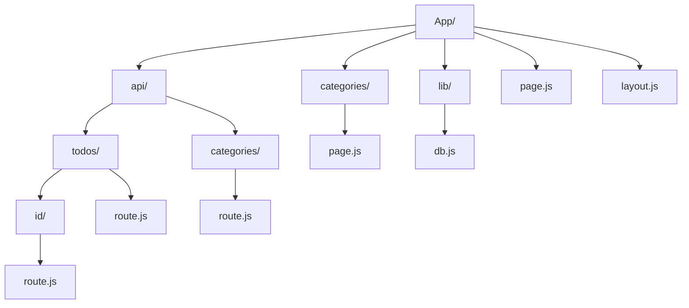
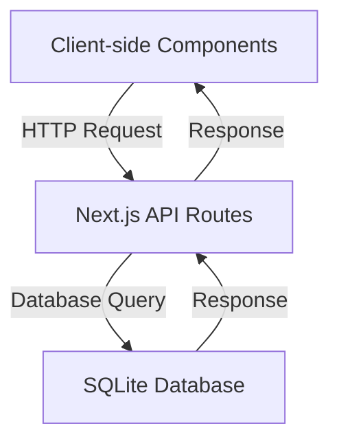

 Ohjelmistokehityksen teknologiat - Seminaarityö

# Next.js Todo-App
Hilja Katajamäki

27.04.2025

## Sisältö
- [1 Johdanto](#johdanto)
- [2 Käytetyt teknologiat ja tekniikat](#käytetyt-teknologiat-ja-tekniikat)
  - [2.1 App Router](#app-router)
  - [2.2 API Routes](#api-routes)
  - [2.3 SSR ja CSR](#ssr-ja-csr)
- [3 Arkkitehtuurikaavio](#arkkitehtuurikaavio)
- [4 Johtopäätökset](#johtopäätökset)
  - [4.1 Reflektointi](#reflektointi)
- [5 Lähteet](#lähteet)

## Johdanto
Web-sovellusten kehityksessä on yleistä käyttää erilaisia kehyksiä eli frameworkeja. Kehykset ovat ohjelmistopohjia, jotka tarjoavat valmiita työkaluja ja rakenteita sovellusten kehittämisen tueksi. Nämä valmiit työkalut tekevät sovellusten kehittämisestä nopeampaa, tehokkaampaa ja helpompaa. Yksi suosituimmista JavaScript-pohjaisista kehyksistä on Next.js.

Next.js rakennetaan React-kirjaston päälle ja se hyödyntää Node.js:ää suorittaakseen palvelin puolen toimintoja, mikä mahdollistaa full-stack-kehityksen yhdessä ympäristössä ([Next.js Dokumentaatio](https://nextjs.org/docs)). Se tarjoaa laajasti eri mahdollisuuksia ja ominaisuuksia, joita ei pelkällä Reactilla pystyisi käyttämään. Sen API Routes-ominaisuuden avulla HTTP-pyyntöjen käsittely on yksinkertaista ja tehokasta. Lisäksi Next.js tukee palvelinpuolen renderöintiä (SSR) ja asiakaspuolen renderöintiä (CSR). Tätä voidaan hyödyntää suorituskyvyn ja käyttäjäkokemuksen parantamiseksi.

Tässä seminaarityössä tutustutaan Next.js:ään ja erityisesti sen yllä mainittuihin ominaisuuksiin. Työssä rakennetaan yksinkertainen Todo-sovellus, jossa voi luoda ja katsella todoita eli tehtäviä sekä kategorioita. Sovelluksessa voi myös poistaa tehtäviä ja lisätä kategorian tehtäville. Yksinkertaisen sovelluksen avulla voi kokeilla ja implementoida erilaisia ominaisuuksia helposti, jonka takia tähän työhön on valittu Todo-sovellus. Sovelluksessa keskitytään erityisesti API-reititykseen ja App Routeriin. 

Työn tavoitteena on tutustua Next.js:ään tarjoamiin mahdollisuuksiin ja oppia soveltamaan sen ominaisuuksia omassa sovelluksessa. 

## Käytetyt teknologiat ja tekniikat

Teknologiat:
- Next.js - Javascript-pohjainen kehys
- SQLite - kevyt tietokanta, jota käytetään sovelluksen tietojen tallentamiseen
- Material-UI - React-komponenttikirjasto, joka tarjoaa tyyliteltyjä käyttöliittymä komponentteja

Tekniikat:
- App Router
- API Routes
- SSR (Server-Side Rendering)
- CSR (Client-Side Rendering)
  
### App router
App Router on Next.js:n tiedostopohjainen reititin, joka mahdollistaa sovelluksen reitityksen hallinnan ilman erillisiä reititystiedostoja ([Next.js Dokumentaatio](https://nextjs.org/docs/app)).  Tämä tarkoittaa, että sovelluksen reitit määräytyvät hakemistorakenteen mukaan, mikä yksinkertaistaa koodin hallintaa ja selkeyttää reittien määrittelyn. 

#### Hakemisto rakenne


Kaaviossa on esitetty Todo-sovelluksen hakemistorakenne, joka hyödyntää App Routerin tiedostopohjaista reititystä. ``App`` -kansio toimii pääkansiona, joka sisältää sovelluksen eri osiot kuten API-reitit ja sovelluksen sivut sekä niiden reitit. Esimerkiksi ``categories``-kansio, joka sijaitsee ``app``-kansion sisällä, määrittää reitin ``/categories``. Tämä reitti vie ``categories``-kansion sisällä olevaan ``page.js``-sivuun. Kun käyttäjä painaa Todo-sovelluksessa AppBarin "categories"-painiketta, sovellus ohjaa hänet ``/categories``-reitille ja näyttää ``page.js``-sivun sisällön. Jokaisen app reitin sisällä on page.js tiedosto, joka on reitillä renderöitävä sivu.

Alla on koodiesimerkki ``layout.js``-tiedostosta, jossa sivujen navigaatio sijaitsee. Koodiesimerkistä näkee, miten reitit lisätään AppBariin. AppBar on yksi Material UI -kirjaston komponentti:

```
<AppBar position="sticky">
          <Toolbar>
            <Typography variant="h6" sx={{ flexGrow: 1 }}>
              My Todo App
            </Typography>
            <Tabs value={selectedTab} onChange={handleTabChange} textColor="inherit"> //Reitit
             <Tab label="Todos" component={Link} href="/" />*
             <Tab label="Categories" component={Link} href="/categories" />*
            </Tabs>
          </Toolbar>
        </AppBar>
```

### API Routes
Sovelluksessa on käytetty Next.js:n API Routes -ominaisuutta. Api Routes-ominaisuus tarjoaa ratkaisun julkisen API:n luomiseen Next.js sovelluksessa ([Next.js Dokumentaatio](https://nextjs.org/docs/pages/building-your-application/routing/api-routes)). Ominaisuuden avulla voidaan käsitellä HTTP-pyyntöjä helposti. 

Todo-sovelluksen API-reitit sijaitsevat ``api``-kansion sisällä. API-reitit kuten ``api/todos`` ja ``api/categories`` ottavat vastaan clientin HTTP-pyyntöjä(GET,POST,PUT,DELETE) ja käsittelevät pyynnöt, jonka jälkeen ne lähettävät vastauksen clientille. Näiden reittien kautta asiakaspuolen komponentit voivat hakea, muokata tai poistaa tietoa. Jokaisen reitin sisällä on ``route.js`` tiedosto, jossa reitittimet sijatisevat.

Alla on esimerkki GET categories API-reitittimestä, joka sijaitsee ``api/categories`` reitillä ``route.js``-tiedoston sisällä:

```
export async function GET() {
  const categories = await getCategories();
  return new Response(JSON.stringify(categories), {
    status: 200,
    headers: { 'Content-Type': 'application/json' },
  });
}
```
Reititin ottaa HTTP-pyynnön vastaan ja sitten hakee ``getCategories`` metodin tietokannasta ja lähettää tämän jälkeen clientille vastauksena kaikki kategoriat.

Sovelluksessa on myös käytetty dynaamista reititystä. Dynaamiset reitit välittävät dataa URL:ää pitkin. Tehtävien poistamista varten käytetään dynaamista reittiä ``api/todos/[id]``, joka käsittelee tietyn tehtävän poistamista.  Tällöin API-reititin ottaa polusta dynaamisen arvon ([id]) ja suorittaa DELETE operaation kyseisen id:n omistavalle tehtävälle. 

Sovelluksessa on myös SQLite tietokanta, joka on määritelty ``lib``-kansiossa ``db.js``-tiedostossa. API-reitit hyödyntävät tietokannan toimintoja importtaamalla ne ``db.js``-tiedostosta. Näiden toimintojen avulla API-reitit pystyvät käsittelemään tietoa helpommin ja suorittamaan tietokannan operaatioita kuten tehtävien hakemista, lisäämistä, päivittämistä ja poistamista.

Alla on esimerkki ``db.js``-tiedoston ``getCategories`` metodista, jota käytetään GET categories API-reitittimessä:

```
// Fetch all categories
export async function getCategories() {
  const db = await openDb();
  return await db.all('SELECT * FROM categories');
}
```
### SSR ja CSR
Server-Side Rendering (SSR) ja Client-Side Rendering (CSR) ovat kaksi erilaista tekniikkaa, joita käytetään sovelluksen datan renderöintiin. Next.js tarjoaa molemmat vaihtoehdot.

Server-Side Rendering (SSR) tarkoittaa, että palvelin generoi HTML-sisällöb serverillä ja lähettää ne sitten clientille ([Mdn web docs](https://developer.mozilla.org/en-US/docs/Glossary/SSR)).

Client-side Rendering (CSR) taas tarkoittaa, että sisältö generoidaan Clientin eli asiakkaan selaimessa.

Tässä Todo-sovelluksessa molempia teknologioita hyödynnetään tilanteen mukaan. Uusimmissa Next.js-versioissa komponentit ovat oletuksena server-side komponentteja, mutta ne voidaan määritellä myös client-side komponenteiksi lisäämällä tiedoston alkuun ``"use client;"`` koodi ([Next.js Dokumentaatio](https://nextjs.org/docs/app/building-your-application/rendering/server-components)). 

## Arkkitehtuurikaavio


Arkkitehtuurikaavio kuvaa sovelluksen rakennetta, jossa asiakaspuolen komponentin tekevät HTTP-pyyntöjä Next.js:n API Routes-reiteille. Nämä reitit käyttävät tietokannan kyselyfunktioita ja palauttavat tiedot takaisin asiakaspuolelle.

## Johtopäätökset
Työn aikana huomattiin, että Next.js tarjoaa erittäin joustavan ja tehokkaan ympäristön web-sovellusten kehittämiseen. App Routerin avulla reitityksen hallinta on selkeää ja helposti ylläpidettävää. Api Routes -ominaisuus puolestaan mahdollistaa suoraviivaisen tavan käsitellä HTTP-pyyntöjä ja luoda reitittimet.

Tärkeä havainto työn aikana oli myös miten SSR ja CSR eroavat toisistaan. Sovelluksessa hyödynnettään molempia renderöinti tapoja, vaikka SSR:n renderöinti Todo-sovelluksessa on vähäisempää. Tausta tutkimuksen aikana opin niiden merkityksen ja sen, kuinka SSR ja CSR voivat oikeassa käytössä tehdä sovelluksesta responsiivisemman ja tehokkaamman. 

### Reflektointi
Työskentelyn aikana pääsin tutustumaan Next.js:n, johon en ennen ollut perehtynyt. Kiinnostuin erityisesti App Routerin ja Api routes -reittien käytöstä, sillä niiden käyttö on selkeää ja järjestelmällistä. Päätin lisätä sovellukseen tietokannan, koska halusin kokeilla, miten API reitit toimisivat tietokannan kanssa. Opin siis myös lisäämään tietokannan Next.js sovellukseen, joka osoittautui olemaan hyvin yksinkertaista. API-reitit toimivat hyvin tietokannan kanssa, ja opin myös, miten reitit mahdollistavat dynaamisen datan käsittelyn.

Opin erityisesti SSR ja CSR eroista paljon. Vaikka en päässyt syventämään SSR:n mahdollisuuksia tässsä työssä, raapaisin kuitenkin sen pintaa. Päätin keskittyiä reitityksiin, sillä ne herättivät mielenkiintoni ensimmäiseksi. Luin kuitenkin paljon erilaisia materiaaleja ja katsoin esimerkkejä SSR käytöstä, joten nyt minulla on melko hyvä kuva siitä miten sitä voidaan implementoida sovelluksiin. 

Next.js:n avulla pystyy kehittämään full-stack web-sovelluksia helposti. Sen käytänteet ovat järjestelmällisiä ja nopeasti ymmärrettävissä sekä tekevät sovelluksen rakentamisesta yksenkertaisempaa. Next.js:llä on laajasti eri ominaisuuksia, joita kaikkia ei tässä työssä ehditty käsittelemään. Tästä aiheesta voisi tutkia vielä esimerkiksi kuvien optimointi-ominaisuutta ja middleware-toimintoja.

## Lähteet
- [mdn web docks](https://developer.mozilla.org/en-US/docs/Glossary/SSR)
- [Next.js verkkosivut](https://nextjs.org/docs/app/getting-started)


